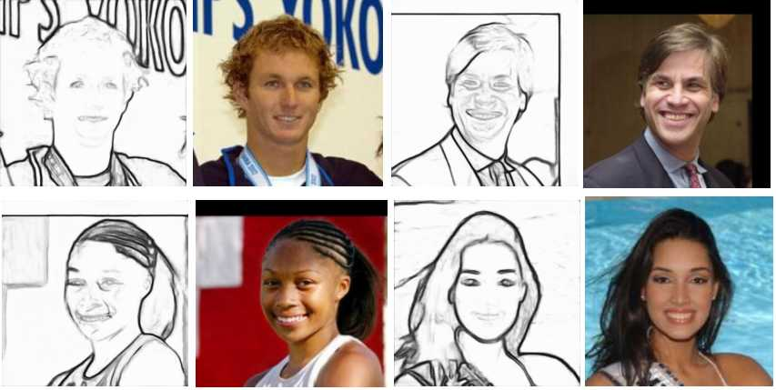

# Sketch to Face



Start sketch mapper model training:  
```python train_mapper.py --config_file ./configs/config.yaml``` 

Start sketch to face image generation:  
```python test.py --config_file ./configs/config.yaml --image_folder ./test_image```  
```image_folder``` - folder with face images

Before launching:
1. ```pip install -r requirements.txt```
2. ```pip install ninja```
3. [Load image_to_sketch weights to 'weights' folder](https://cloud.mail.ru/public/TzWU/DvY2kgWPF)
4. [Load StyleGAN2 pickle file to 'weights' folder](https://cloud.mail.ru/public/aA8b/6ogbFee4u)
5. [Load pretrained sketch_mapper weights to 'weights' folder](https://cloud.mail.ru/public/SwT2/prcJWRFe5)
6. Check params in config.yaml

